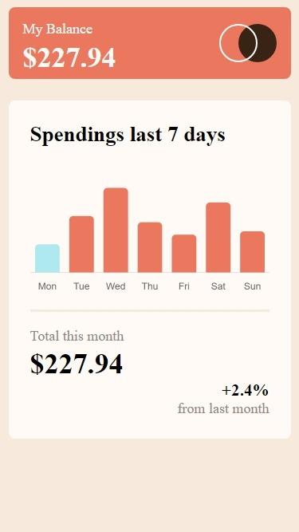
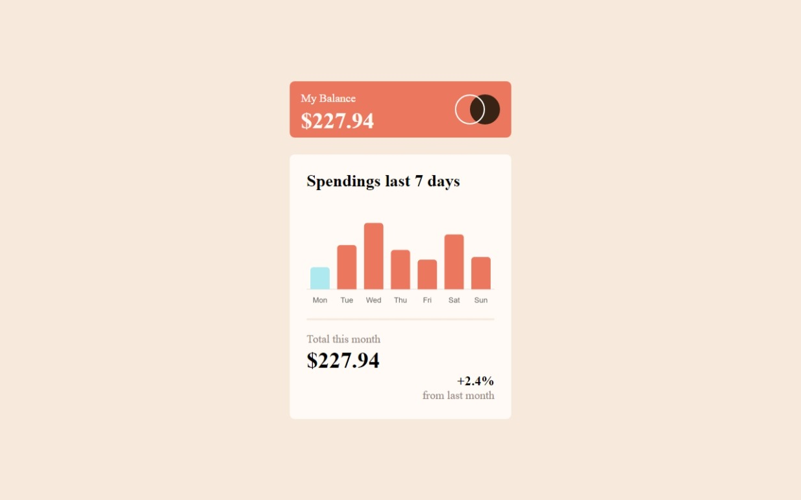

# Frontend Mentor - Expenses chart component solution

This is a solution to the [Expenses chart component challenge on Frontend Mentor](https://www.frontendmentor.io/challenges/expenses-chart-component-e7yJBUdjwt). Frontend Mentor challenges help you improve your coding skills by building realistic projects. 

## Table of contents

- [Overview](#overview)
  - [The challenge](#the-challenge)
  - [Screenshot](#screenshot)
  - [Links](#links)
- [My process](#my-process)
  - [Built with](#built-with)
  - [What I learned](#what-i-learned)
  - [Continued development](#continued-development)
  - [Useful resources](#useful-resources)
- [Author](#author)
- [Acknowledgments](#acknowledgments)

**Note: Delete this note and update the table of contents based on what sections you keep.**

## Overview

### The challenge

Users are able to:

- View the bar chart and hover over the individual bars to see the correct amounts for each day
- See the current day’s bar highlighted in a different colour to the other bars
- View the optimal layout for the content depending on their device’s screen size
- See hover states for all interactive elements on the page

### Screenshot

### Links

- Solution URL: [Github Code ](https://github.com/DR-KSP-VIRUS/expenses-chart-component)
- Live Site URL: [Live Site](https://expenses-chart-component-one-kappa.vercel.app/)

## My process

### Built with

- Semantic HTML5 markup
- CSS custom properties
- Flexbox
- CSS Grid
- Mobile-first workflow
- [Vue.js](https://vuejs.org/) - React framework
- [Vue-Chartjs](https://vue-chartjs.org/) - For Bar chart
- [axios](https://https://axios-http.com/docs/intro) - For Data fetching

### Useful resources

- [Vuejs](https://vuejs.org) - This helped for building out the components and layout of the project.
- [Chartjs](https://www.example.com) - This is an amazing article which helped me finally understand how to use charts in web components. I'd recommend it to anyone still learning this concept.

## Author

- Frontend Mentor - [@Dr.KSP-VIRUS](https://www.frontendmentor.io/profile/DR.KSP-VIRUS)
- Twitter - [@kuma_sampson](https://x.com/kuma_sampson)
